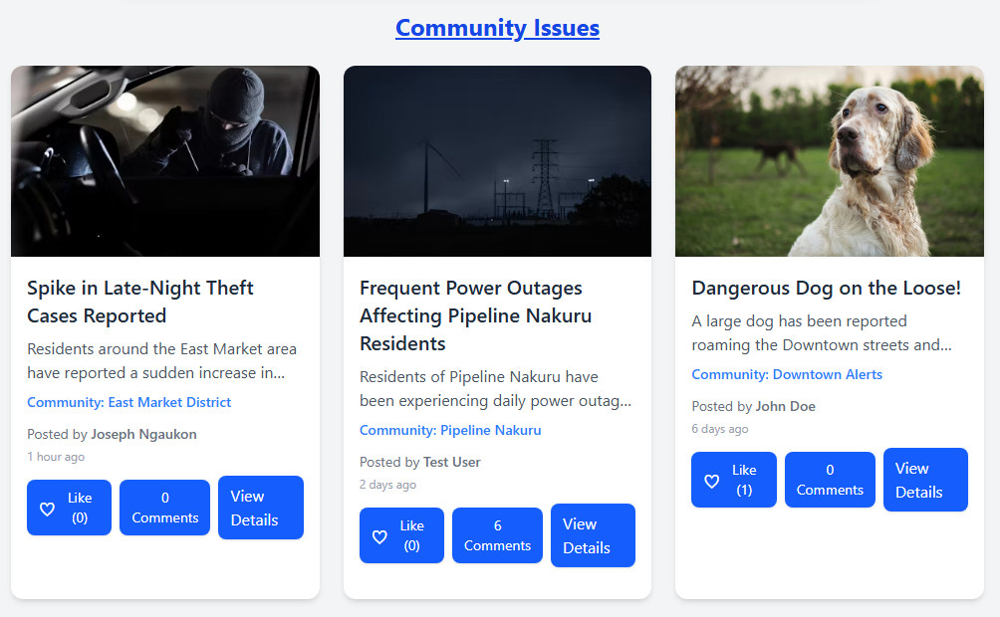
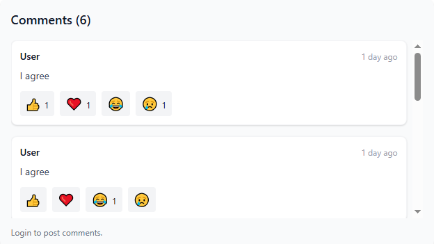

# 🏙️ City-Care

[](https://github.com/Ngaukon/City-Care)
[](LICENSE)

**City-Care** is a community-driven platform for reporting city issues like power outages, theft, broken streetlights, accidents, and other public concerns. Residents can post issues, comment, react, and track resolutions.

---

## 🚀 Table of Contents

* [Features](#-features)
* [Screenshots](#-screenshots)
* [Installation](#-installation)
* [Usage](#-usage)
* [Technologies](#-technologies)
* [Future Improvements](#-future-improvements)
* [Contributing](#-contributing)
* [License](#-license)

---

## ✨ Features

* ✅ **User Authentication** – register and login securely with JWT
* ✅ **Create Posts** – report issues with title, description, community, and images/videos
* ✅ **Commenting System** – expand/collapse comments, add new comments if logged in
* ✅ **Like & React** – react to posts and comments with emojis
* ✅ **Time Display** – “time ago” format for posts and comments
* ✅ **Community Filter** – view posts by specific community
* ✅ **Responsive Design** – mobile-first, works on all devices
* ✅ **Notifications** – toast messages for successful actions

---

## 🖼️ Screenshots

### Home Page


### User Post with Comments and Details



### Login / Register Post


### Single Post Page


### Comments



---

## 💻 Installation

1. Clone the repository:

```bash
git clone https://github.com/Ngaukon/City-Care.git
cd City-Care
```

2. Install dependencies:

```bash
# Backend
cd backend
npm install

# Frontend
cd ../frontend
npm install
```

3. Configure environment variables:

**Backend `.env`**

```
MONGO_URI=your_mongo_connection_string
JWT_SECRET=your_jwt_secret
PORT=5000
```

**Frontend `.env`**

```
VITE_API_BASE_URL=http://localhost:5000
```

4. Run the servers:

```bash
# Backend
npm run dev

# Frontend
npm run dev
```

5. Open your browser at `http://localhost:5173`

---

## 🛠️ Usage

* Navigate to `/register` to create a new account
* Login via `/login`
* Create new posts via `/create`
* View posts on the homepage or filter by community
* Click a post to view details, comments, and reactions
* Expand/collapse comments and add new comments if logged in

---

## 🧰 Technologies

**Frontend:** React 19.x, Tailwind CSS, React Router 7.x, react-hot-toast
**Backend:** Node.js, Express.js, MongoDB (Mongoose), JWT
**Tools:** Vite, Axios

---

## 🌟 Future Improvements

* 📧 **Email Verification** – verify user accounts on registration
* 💬 **Enhanced Comment Interaction** – reply, edit, and threaded comments
* ⏳ **Loading Spinners** – interactive spinners while logging in, registering, or posting
* ✏️ **Post Updates** – users can edit existing posts
* 📸 **Media Uploads** – support for images and videos with previews
* 🔔 **Notifications** – alert users of post updates, comments, and likes
* 🛠️ **Admin Panel** – moderate content and manage communities
* 🔍 **Search & Filter** – search posts by title, community, or keywords

---

## 🤝 Contributing

1. Fork the repository
2. Create a new branch: `git checkout -b feature/YourFeature`
3. Commit your changes: `git commit -m "Add new feature"`
4. Push to the branch: `git push origin feature/YourFeature`
5. Open a pull request

---

## 📄 License

This project is licensed under the **MIT License** – see the [LICENSE](LICENSE) file for details.

---


